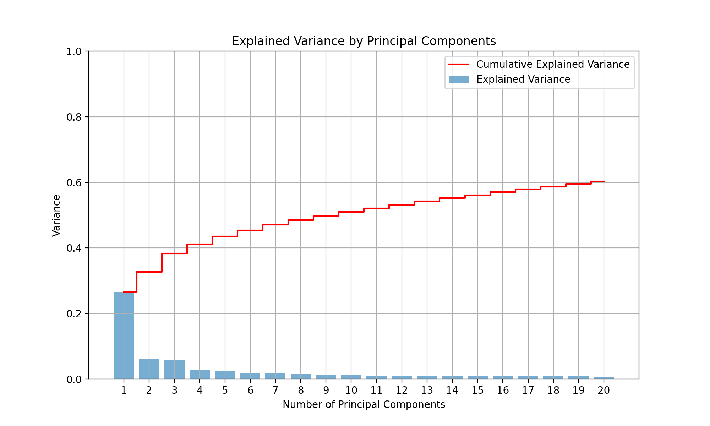
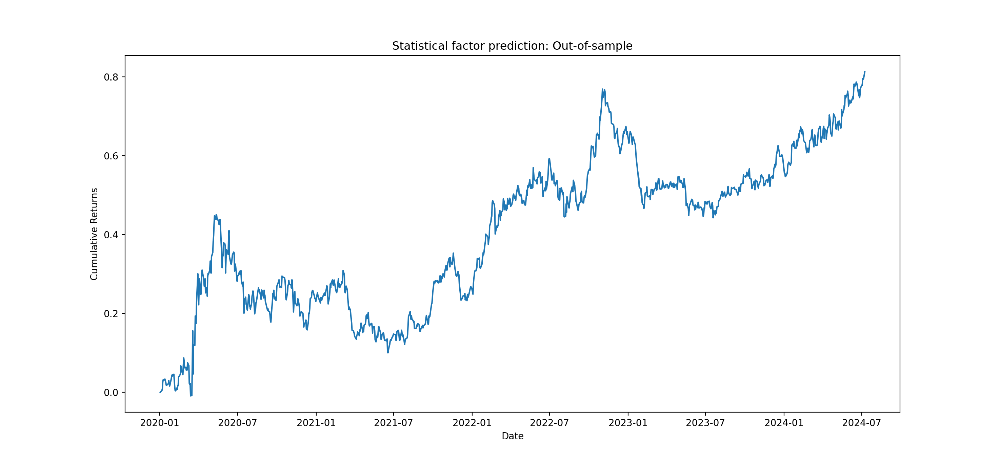

# Stock Performance Prediction Using PCA and OLS

## Overview

This project implements a stock performance prediction strategy using Principal Component Analysis (PCA) and Ordinary Least Squares (OLS) regression. The goal is to identify the best and worst performing stocks in the S&P 500 over a 5-year period (2019-2024) and execute a long/short trading strategy based on these predictions.

## Features

- **Data Fetching**: Fetches historical stock data from Yahoo Finance.
- **PCA Analysis**: Analyzes stock returns to extract key statistical factors.
- **OLS Regression**: Predicts future stock returns based on the identified factors.
- **Trading Strategy**: Longs the 10 best predicted stocks and shorts the 10 worst predicted stocks.
- **Performance Metrics**: Calculates cumulative returns, CAGR, Sharpe ratio, maximum drawdown, and Calmar ratio.

## Installation

Make sure you have Python installed along with the necessary libraries. You can install the required packages using:

```bash
pip install numpy pandas matplotlib scikit-learn yfinance 
```

## Usage

1. **Data Preparation**: The script fetches stock data from Yahoo Finance, or reads from a local CSV if available. Ensure the `yfinance_dataFetch` module is properly implemented.

2. **Run the Analysis**: Execute the script to perform PCA, regression, and visualize the results.

   ```bash
   python your_script_name.py

## Review Output

The script prints performance metrics and displays a plot of cumulative returns.

## Code Structure

- `fetch_and_prepare_data`: Fetches and cleans stock data.
- `plot_explained_variance`: Visualizes the explained variance from PCA.
  In this study, the 20 main components are extracted, and their explained variance ratio is plotted. In the trading strategy, we only consider the top 5 factors to linear regress with the 500 stocks returns.
  

- `perform_pca_and_regression`: Conducts PCA and OLS regression to generate trading signals.
- `calculate_max_dd`: Computes the maximum drawdown and duration.

## Results

The output includes:

- Cumulative returns plot for the prediction period.


  
- Performance metrics: CAGR, Sharpe ratio, maximum drawdown, and Calmar ratio.
- `CAGR=0.141205`
- ` Sharpe=0.784536`
- ` maxDD=-0.241537`
- ` maxDDD=620`
- ` Calmar ratio=0.584612`
 

## Contributing

Feel free to fork the repository and submit pull requests for any enhancements or bug fixes.

## License

This project is licensed under the MIT License.
